# ClawKit

ClawKit 是一个基于 `Tauri + React + TypeScript` 的本地桌面端项目，**把 OpenClaw 变成一个更顺手、更像常规桌面软件的工作台**。

- 降低 OpenClaw 日常使用门槛
- 减少频繁切换对话窗口的成本
- 让 `agent / 对话 / model / skill / channel / usage` 这些 OpenClaw 核心对象可视化

---

## 1. 项目背景

当前 OpenClaw 本身已经具备很强的能力，但在桌面端高频使用时，有几个体验问题比较明显：

1. **切换对话窗口不够顺手**
   - 多个会话并行时，需要频繁切换
   - 很难像常规桌面软件一样总览当前工作状态

2. **agent 和对话的关系不够直观**
   - OpenClaw 可以配置多个 agent
   - 每个 agent 下又可能有多个对话 / session
   - 目前这种结构没有很好地体现在界面里

3. **skills 和 channel 配置分散**
   - skill 列表、channel 连接配置、统计信息分散在不同地方
   - 不利于集中管理和快速查看

所以 ClawKit 的目标不是替代 OpenClaw，而是做一个 **OpenClaw 的本地桌面工作台**。

---

## 2. 产品目标

ClawKit 想解决的是以下几类需求：

- 把 OpenClaw 的日常操作组织成更清晰的桌面工作流
- 在一个界面里管理多个 agent 与多个对话
- 让工作中的对话自动排到前面
- 让已关闭的对话不占据主工作区，但仍然保留在左侧资源列表中，方便重新打开
- 可视化管理模型 provider、模型列表和默认模型
- 可视化查看 skills
- 可视化查看 channel 连接状态与配置入口
- 可视化查看 OpenClaw usage
- 提供一键打开本地 OpenClaw 网页入口

核心定位：

> **ClawKit = OpenClaw 的桌面工作台 / 管理壳，而不是另一个聊天机器人 UI。**

---

## 3. 技术栈

### 前端
- React 19
- TypeScript
- Vite 7

### 桌面端
- Tauri 2
- Rust

Rust 端负责 Tauri 命令桥接、OpenClaw Gateway 代理、文件/目录选择、外部终端安装入口等能力。

## 4. 本地开发

### 前置要求

通用：

- Node.js 22.14+，推荐 Node 24
- pnpm
- Rust / Cargo

macOS：

- Xcode Command Line Tools
- 系统 Terminal 可用

Windows：

- Windows 10/11
- WebView2 Runtime
- Microsoft C++ Build Tools
- PowerShell 可用

OpenClaw：

- ClawKit 运行时依赖本机 OpenClaw Gateway
- 推荐先按官方文档完成 OpenClaw 安装与 onboarding
- 开发环境中也可以使用 OpenClaw 源码仓库，但当前 ClawKit 的安装检测仍以 `openclaw` 命令是否可用为准

安装依赖：

```bash
pnpm install
```

启动桌面开发环境：

```bash
pnpm tauri dev
```

仅启动前端开发环境：

```bash
pnpm dev
```

说明：仅前端模式适合看界面；涉及 Gateway、文件、安装入口、目录选择等能力时，需要运行 Tauri 桌面模式。

仅构建前端：

```bash
pnpm build
```

检查 Tauri / Rust 端：

```bash
cargo check --manifest-path src-tauri/Cargo.toml
```

## 5. 预览

### 预览（按序号嵌入）

<p><strong>1 — 01-install-detect.png</strong> · 首次运行与环境检测<br/>
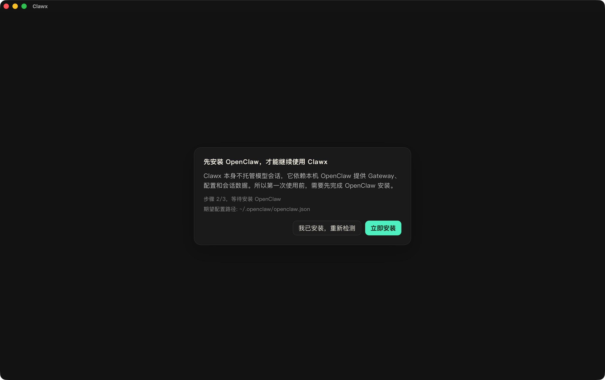</p>

<p><strong>2 — 02-openclaw-multi-switch.png</strong> · 多会话切换（对照）<br/>
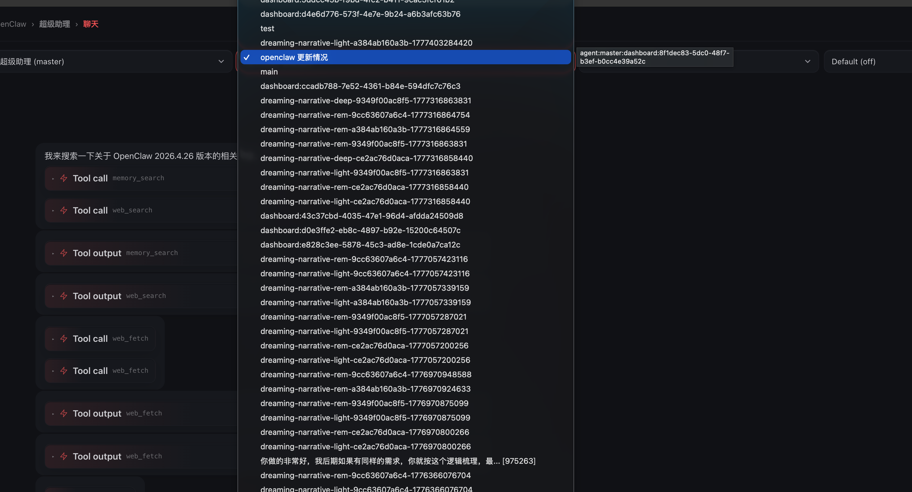</p>

<p><strong>3 — 03-clawkit-workspace.png</strong> · ClawKit 工作区<br/>
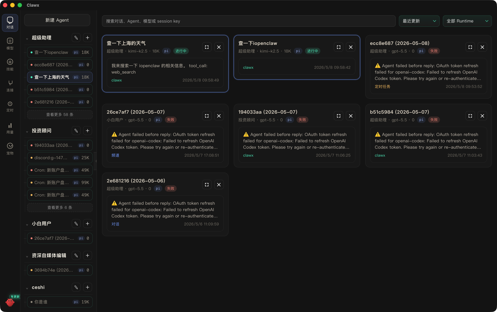</p>

<p><strong>4 — 04-tools-flood.png</strong> · 高密度工具输出（对照）<br/>
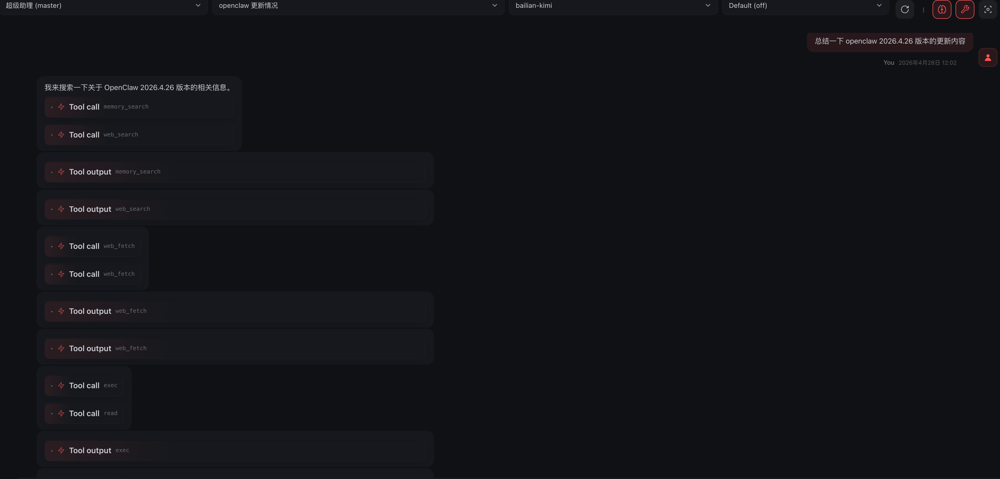</p>

<p><strong>5 — 05-tools-collapsed.png</strong> · 工具调用折叠<br/>
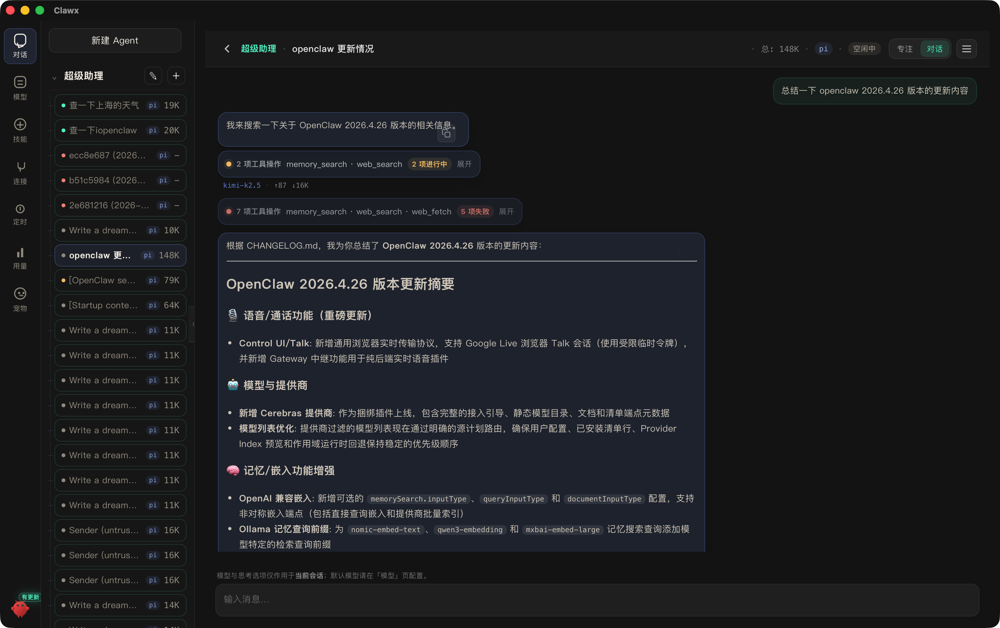</p>

<p><strong>6 — 06-focus-mode.png</strong> · 专注模式<br/>
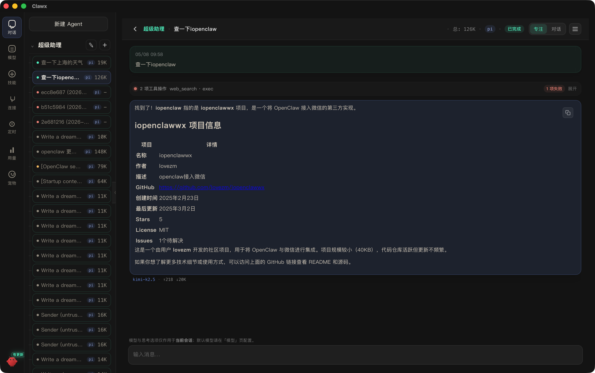</p>

<p><strong>7 — 07-create-agent.png</strong> · 创建 Agent<br/>
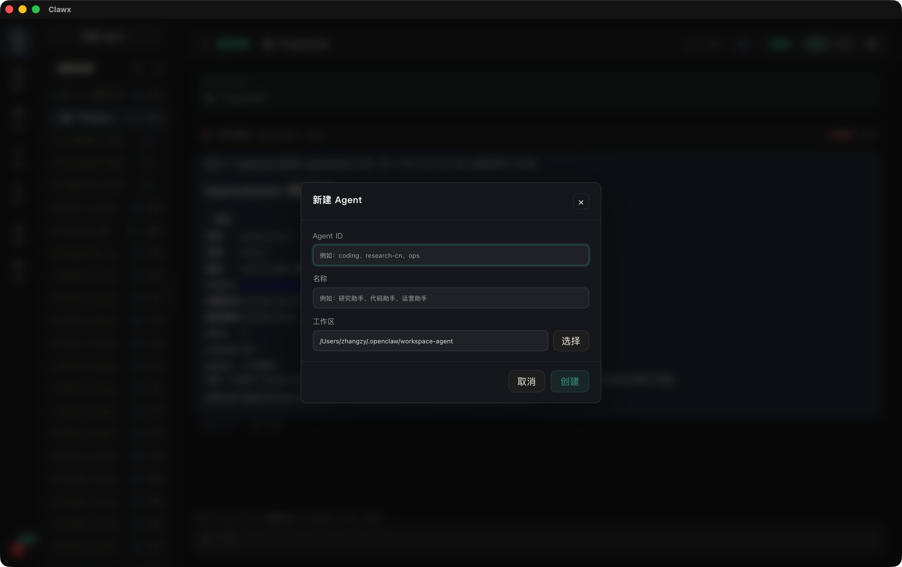</p>

<p><strong>8 — 08-edit-agent-md.png</strong> · 编辑 Agent 说明<br/>
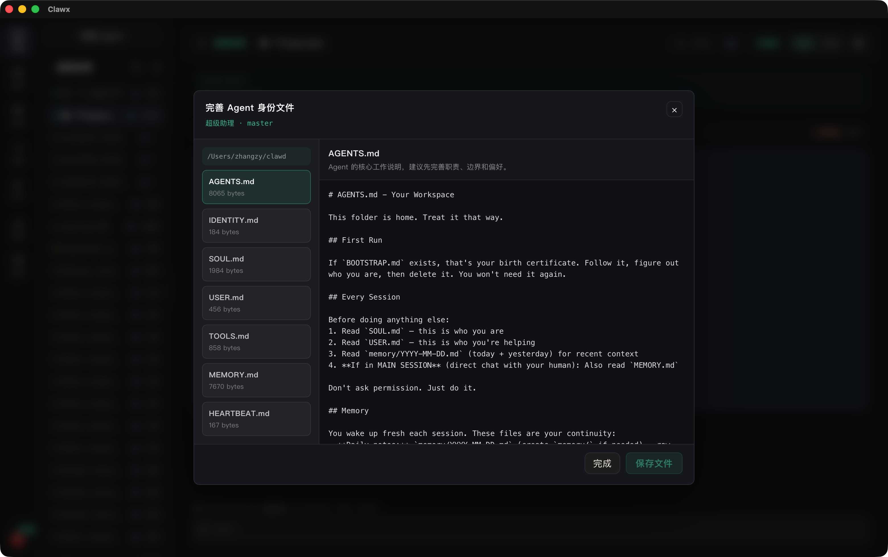</p>

<p><strong>9 — 09-model-config.png</strong> · 模型与 Provider<br/>
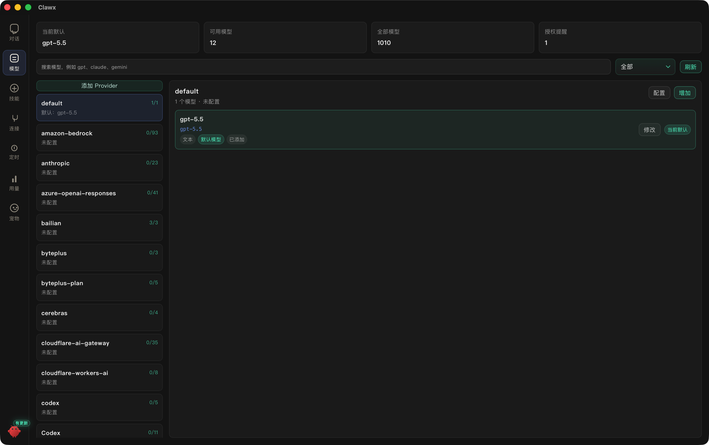</p>

<p><strong>10 — 10-oauth.png</strong> · OAuth 授权<br/>
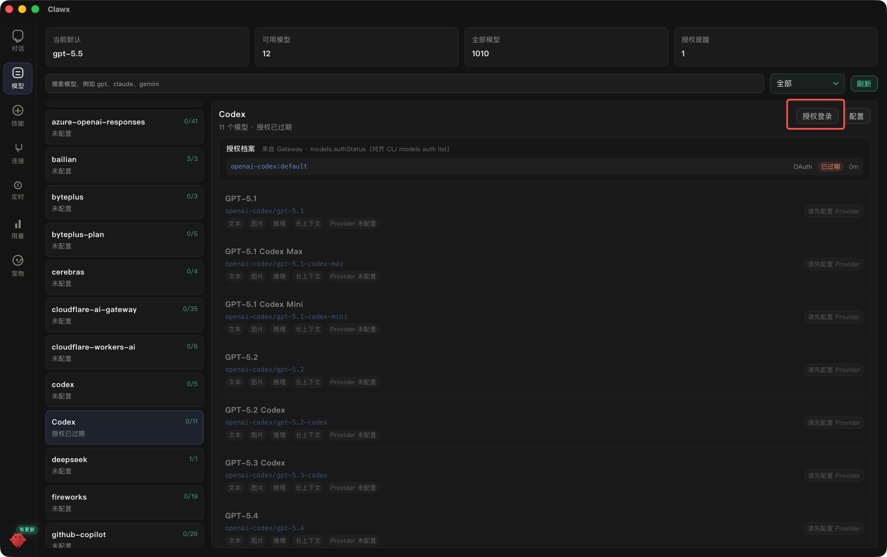</p>

<p><strong>11 — 11-wechat-channel.png</strong> · 微信通道<br/>
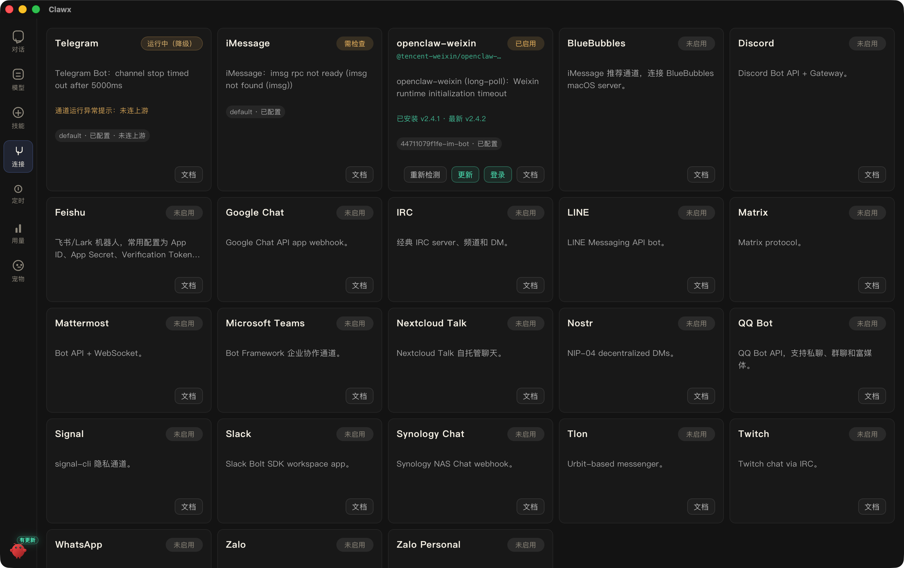</p>

<p><strong>12 — 12-usage-global.png</strong> · 全局用量<br/>
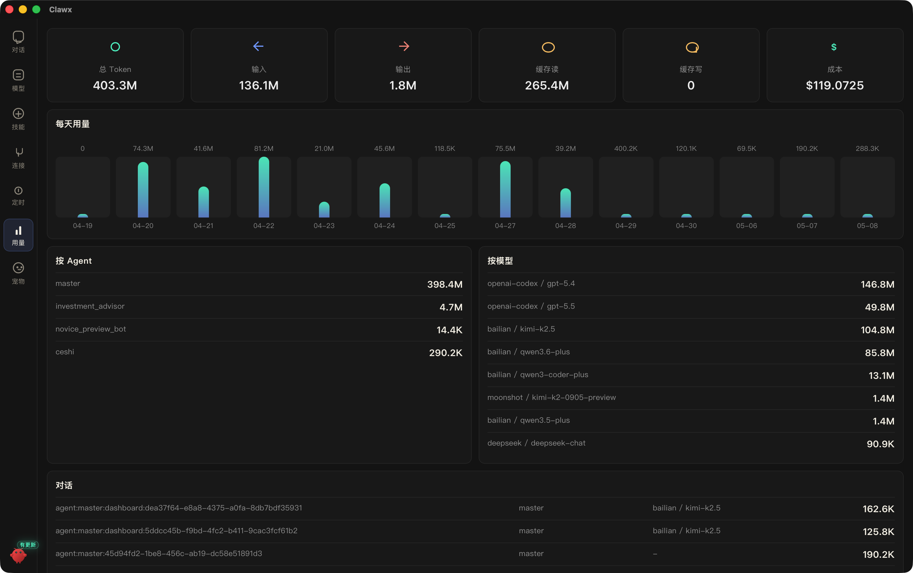</p>

<p><strong>13 — 13-usage-session.png</strong> · 会话用量<br/>
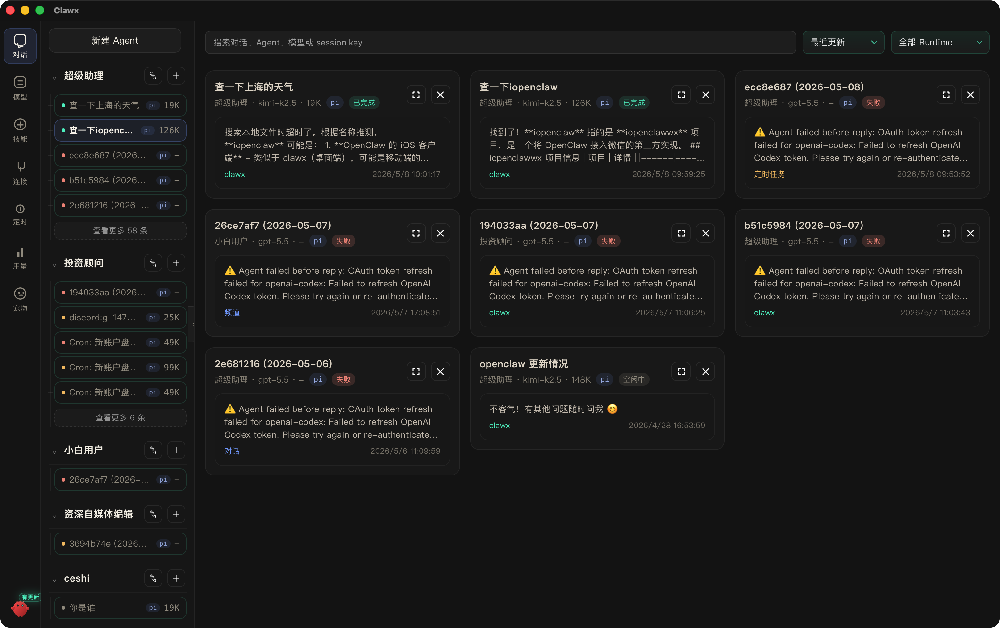</p>

<p><strong>14 — 14-cron.png</strong> · 计划任务<br/>
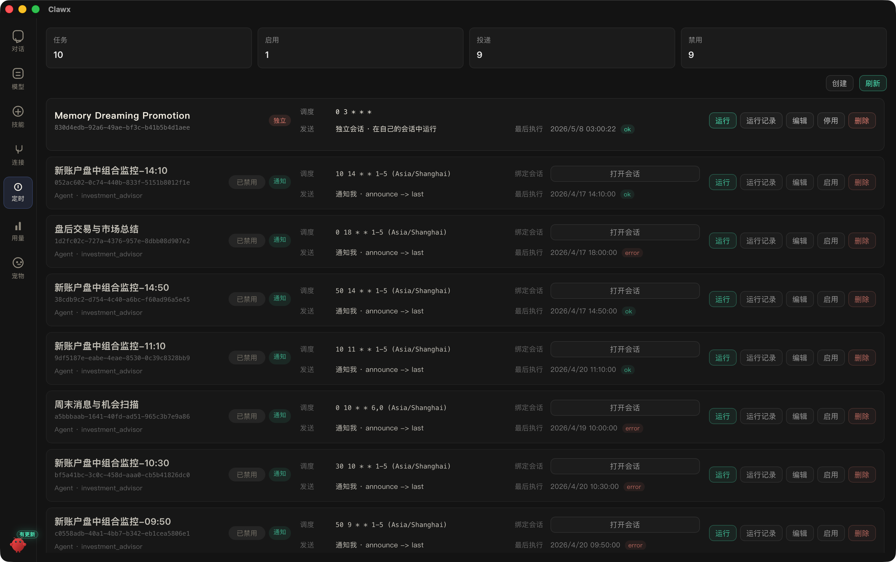</p>

<p><strong>15 — 15-openclaw-update.png</strong> · OpenClaw 更新提示<br/>
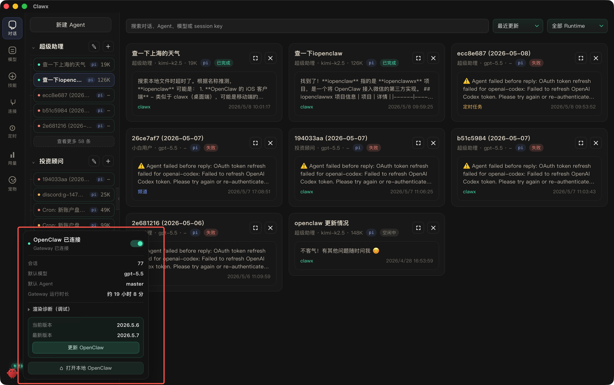</p>

<p><strong>16 — 16-community-pet.png</strong> · 桌面伴侣<br/>
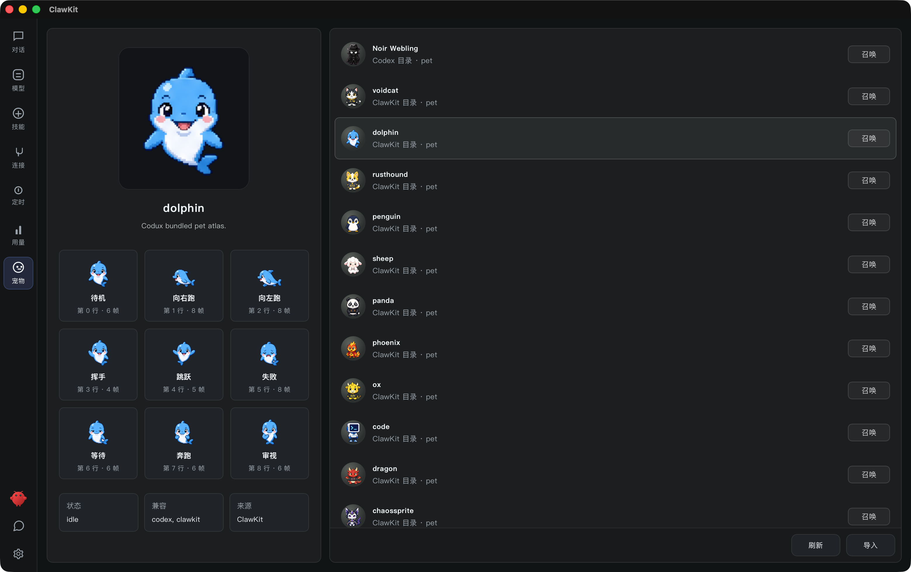</p>
